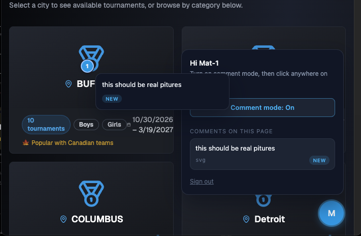

# Elevora — drop-in client feedback for your sites

A tiny, dependency-free widget that lets your client reviewers leave pinned comments directly on your site — Vercel-comments style. A reviewer enters their invite code once, toggles comment mode, clicks anywhere on the page, types a note, done. Comments are delivered to your configured backend.



- Zero runtime dependencies, renders in a Shadow DOM (your styles stay yours)
- Invite-code auth — no accounts, no OAuth
- Pins anchor to the clicked element via a generated CSS selector and survive reloads
- Works with SPAs (Next.js App Router client navigation included)

## Install

```sh
npm i @elevora/comments
```

## React / Next.js (App Router)

Add the component once in your root layout:

```tsx
// app/layout.tsx
import { ElevoraComments } from "@elevora/comments/react";

export default function RootLayout({ children }: { children: React.ReactNode }) {
  return (
    <html lang="en">
      <body>
        {children}
        <ElevoraComments project="my-site" apiBase="https://feedback.example.com" />
      </body>
    </html>
  );
}
```

The component is a client component (`'use client'`) that renders nothing and mounts the widget on the client.

## Vanilla

```ts
import { initElevora } from "@elevora/comments";

const handle = initElevora({ project: "my-site", apiBase: "https://feedback.example.com" });
// later, if needed:
handle.destroy();
```

`initElevora` is idempotent per project and SSR-safe (no-op when `window` is undefined).

## How auth works

Each reviewer gets an invite code (e.g. `ELV-MAT-4821`) from whoever runs the project. They enter it once in the widget; it's exchanged for a token stored in `localStorage`. If the token is ever revoked or expires, the widget falls back to the code form automatically. Reviewers only ever see their own open comments.

## Options

| Option    | Type     | Default      | Description                          |
| --------- | -------- | ------------ | ------------------------------------ |
| `project` | `string` | — (required) | Project key invite codes belong to.  |
| `apiBase` | `string` | — (required) | Your deployment of the Elevora comments API. The package ships with no default backend. |
| `user`    | `SessionUser` | `undefined` | Attributes of the user logged into *your* site (not the reviewer). Optional. Attached to every comment so a report can be read in the context of the persona that saw the page. |

## Identifying the logged-in user

Comments carry two identities: the **reviewer** (invite-code auth — who wrote the note) and, optionally, the **host-site user** (who they were logged in as on your app when they wrote it). The same URL renders differently to an `rta` than to an `admin`, so the persona is often what makes a comment interpretable.

Pass whatever your app knows — every field is optional:

```tsx
<ElevoraComments
  project="my-site"
  apiBase="https://feedback.example.com"
  user={{ id: user.id, role: "rta", viewingAs: "rta", orgId: user.orgId, plan: "pro" }}
/>
```

Personas switch without a reload, so update on change:

```ts
const handle = initElevora({ project: "my-site", apiBase, user: { role: "rta" } });
// later, when the user switches "view as":
handle.identify({ role: "admin", viewingAs: "admin" });
handle.identify(null); // clear
```

The React component re-identifies automatically whenever the `user` prop's contents change. The value is **snapshotted onto each comment at submit time**, so switching persona later never rewrites an existing comment. Well-known fields: `id`, `name`, `email`, `role`, `viewingAs`, `orgId`, `plan`, `locale`, plus a free-form `custom` bag (`Record<string, string | number | boolean>`) for flag buckets, experiment arms, etc.

## License

MIT
